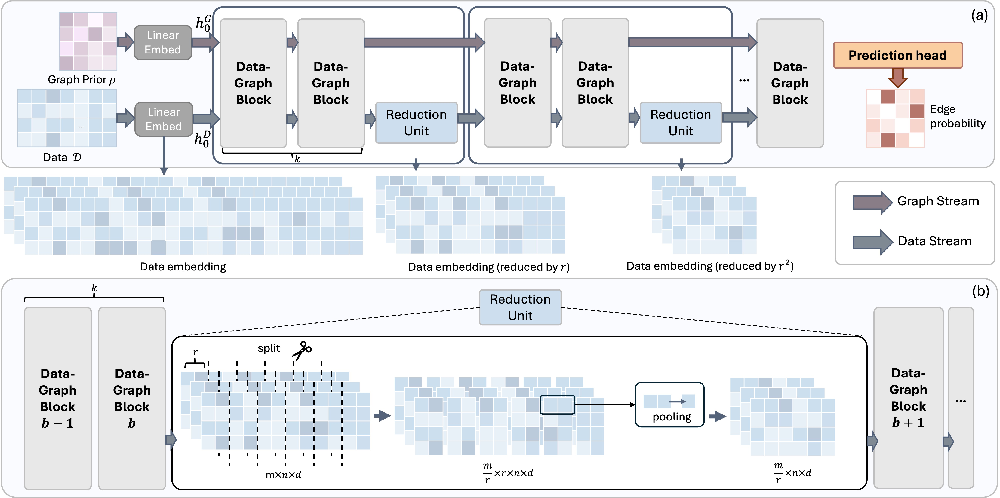

# CauScale
Official implementation of the paper **CauScale: Neural Causal Discovery at Scale** (ICML 2026). [[arXiv](https://arxiv.org/abs/2602.08629)]

## Overview



Causal discovery is essential for advancing data-driven fields such as scientific AI and data analysis, yet existing approaches face significant time- and space-efficiency bottlenecks when scaling to large graphs. To address this challenge, we present CauScale, a neural architecture designed for efficient causal discovery that scales inference to graphs with up to 1000 nodes. CauScale improves time efficiency via a reduction unit that compresses data embeddings and improves space efficiency by adopting tied attention weights to avoid maintaining axis-specific attention maps. To keep high causal discovery accuracy, CauScale adopts a two-stream design: a data stream extracts relational evidence from high-dimensional observations, while a graph stream integrates statistical graph priors and preserves key structural signals. CauScale successfully scales to 500-node graphs during training, where prior work fails due to space limitations. Across testing data with varying graph scales and causal mechanisms, CauScale achieves 99.6% mAP on in-distribution data and 84.4% on out-of-distribution data, while delivering 4×–13,000× inference speedups over prior methods.


## News

- **[June 2, 2026] Code released.**
- **[May 1, 2026] CauScale accepted to ICML 2026.**
- **[Feb 9, 2026] CauScale paper released on arXiv.**

## Installation

```bash
conda env create -f environment.yml
conda activate causcale
```

## Data

**Test data** is available on [HuggingFace](https://huggingface.co/datasets/OpenCausaLab/causcale-data):

```python
from huggingface_hub import hf_hub_download

path = hf_hub_download(
    repo_id="OpenCausaLab/causcale-data",
    filename="data_test.zip",
    repo_type="dataset",
)
```

**Training data** needs to be generated locally. See [`data/README.md`](data/README.md) for full instructions on generating both synthetic and SERGIO gene expression datasets.

## Training

We use the Adam optimizer with lr=1e-4.

**Synthetic data — two-stage training:**

Stage 1 trains on small graphs (10–100 nodes) before generalizing to larger ones (up to 500 nodes).

- Stage 1 (10–100 nodes): 8 GPUs, batch size 8, ~37 hours
- Stage 2 (150–500 nodes): 8 GPUs, batch size 8, ~2.75 hours (requires Stage 1 checkpoint)

```bash
bash bash/train-synthetic-stage1.sh  # stage 1
bash bash/train-synthetic-stage2.sh  # stage 2 (set checkpoint_path in script first)
```

**SERGIO-GRN data — single stage:**

Graph sizes vary within a narrower range (10–200 nodes), so single-stage training suffices.

- 8 GPUs, batch size 1, ~44 hours

```bash
bash bash/train-sergio.sh
```

Key arguments (model architecture and training defaults are in `config/train.yaml`):

| Argument | Default | Description |
|---|---|---|
| `--data_file` | — | path to training data CSV |
| `--inference_data_file` | — | path to evaluation data CSV (inference stage after training) |
| `--results_prefix` | `results` | evaluation results prefix; metrics saved as `{results_prefix}.csv` |
| `--sample_size` | — | number of observations to sample per graph |
| `--batch_size` | 16 | graphs per batch |
| `--checkpoint_path` | — | path to checkpoint for resuming or initializing from Stage 1 |

## Inference

Download pretrained checkpoints from [HuggingFace](https://huggingface.co/OpenCausaLab/causcale-model) and place them under `checkpoints/`:

```python
from huggingface_hub import hf_hub_download

hf_hub_download(
    repo_id="OpenCausaLab/causcale-model",
    filename="synthetic/auprc=0.905_migrated.ckpt",
    repo_type="model",
    local_dir="checkpoints",
)
hf_hub_download(
    repo_id="OpenCausaLab/causcale-model",
    filename="sergio/auprc=0.703_migrated.ckpt",
    repo_type="model",
    local_dir="checkpoints",
)
```

Then run:

```bash
bash bash/inference-synthetic.sh   # synthetic data
bash bash/inference-sergio.sh      # SERGIO gene expression data
```

Results are saved as `{results_prefix}.csv`. To post-process predictions into a DAG, uncomment `--break_cycles` in the inference script.

## Citation

```bibtex
@article{peng2026causcale,
  title={CauScale: Neural Causal Discovery at Scale},
  author={Peng, Bo and Chen, Sirui and Tian, Jiaguo and Qiao, Yu and Lu, Chaochao},
  journal={arXiv preprint arXiv:2602.08629},
  year={2026}
}
```

## Acknowledgements

Parts of this code are adapted from [ESM](https://github.com/facebookresearch/esm) and [SEA](https://github.com/rmwu/sea-reproduce). The SERGIO gene expression simulation pipeline is adapted from [Targeted Cause Discovery](https://github.com/snu-mllab/Targeted-Cause-Discovery), which builds on the SERGIO wrapper from [AVICI](https://github.com/larslorch/avici). We thank the authors for their open-source implementations.